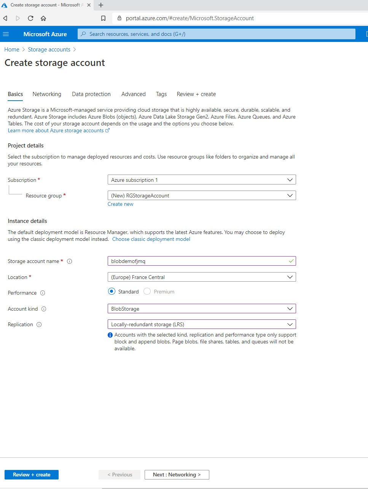
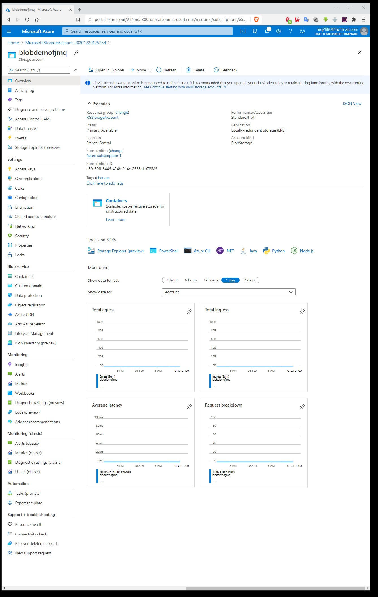
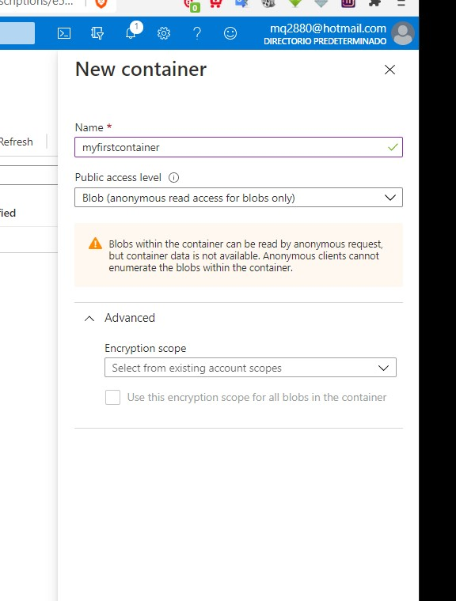
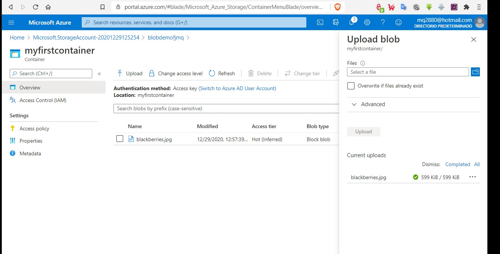
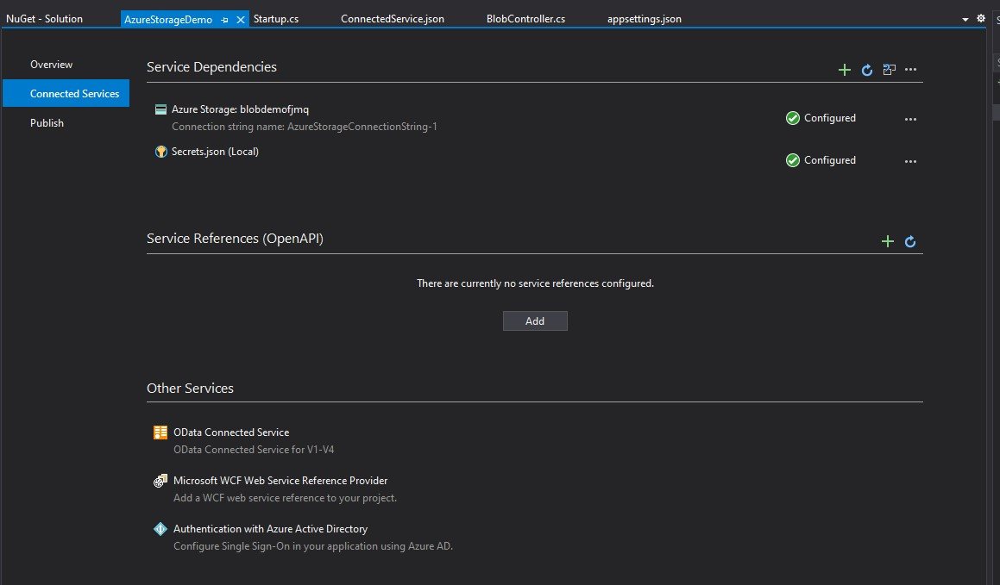
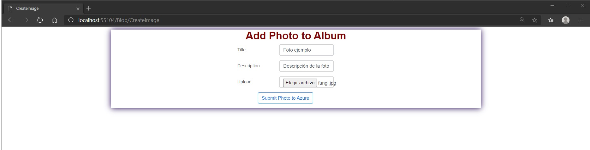
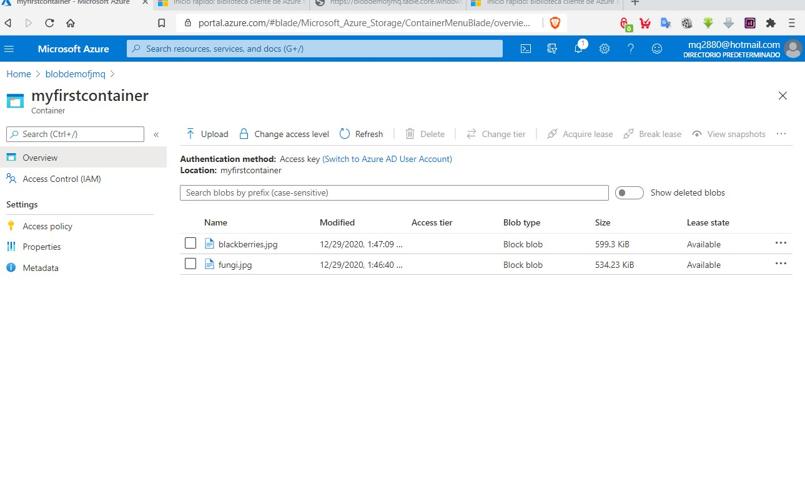

# Tareas del MOC

## Module 14: Hosting and Deployment

# Lesson 3: Microsoft Azure Fundamentals

### Demonstration: How to Upload an Image to Microsoft Azure Blob Storage

- Creamos un nueva cuenta de almacenamiento en Azure

  

  

  

  

  

  

- Añadimos un nuevo contenedor

- Pulsamos en crear

- Subimos una imagen

- Comprobamos lo que ha creado
- En el proyecto añadimos el servicio de almacenamiento

- 

- Modificamos el controlador para que acepte ese servicio

- Ejecutamos la aplicacion y añadimos una foto

  

  

- comprobamos que ha subido

  

